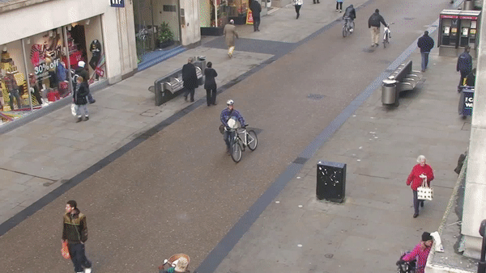

# Pytorch_Yolor_DeepSort
 Yolor and  DeepSort



## Download
### deepsort
Download [ckpt.t7](https://drive.google.com/drive/folders/1xhG0kRH1EX5B9_Iz8gQJb7UNnn_riXi6) copy to deep_sort_pytorch/deep_sort/deep/checkpoint/
### yolor
[yolor-p6.pt](https://drive.google.com/file/d/1WyzcN1-I0n8BoeRhi_xVt8C5msqdx_7k/view?usp=sharing) copy to yolor/weights/

## Tracking sources

Tracking can be run on most video formats

```bash
python3 track.py --source ... --show-vid  # show live inference results as well
```

- Video:  `--source file.mp4`
- Webcam:  `--source 0`
- RTSP stream:  `--source rtsp://170.93.143.139/rtplive/470011e600ef003a004ee33696235daa`
- HTTP stream:  `--source http://wmccpinetop.axiscam.net/mjpg/video.mjpg`
